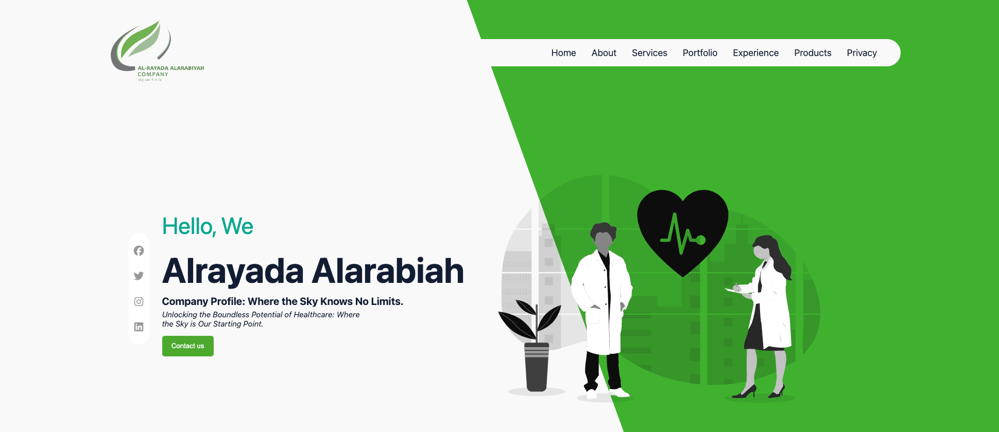
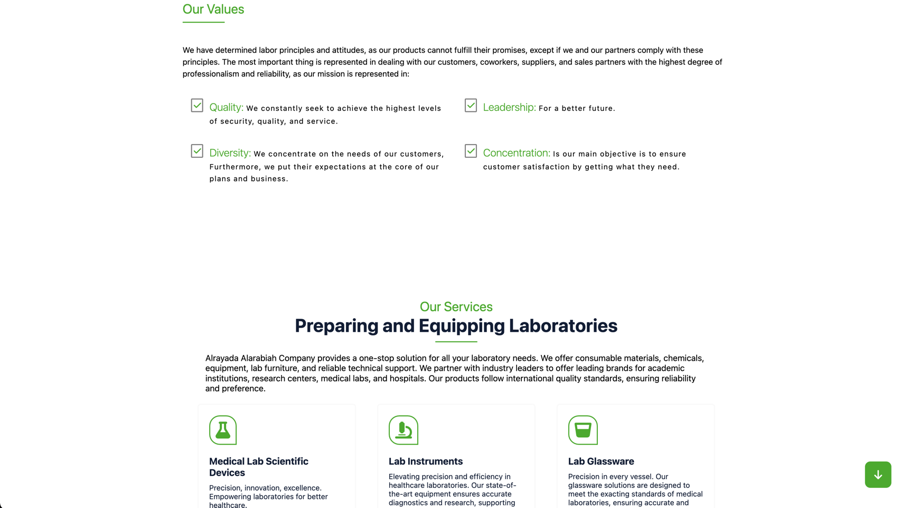
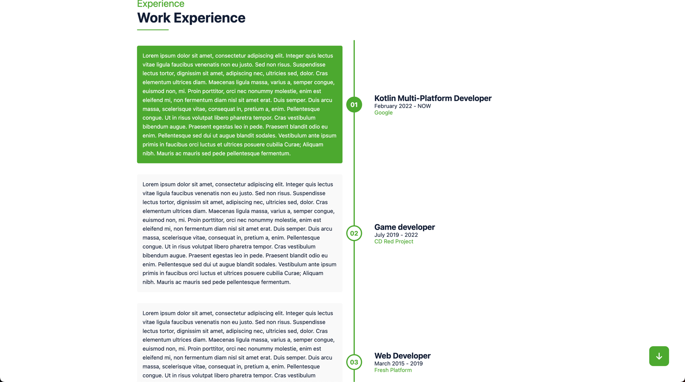

# 🌐 Alrayada Web

A production landing page for [**Alrayada Alarabiah**](https://alrayada.net/)
built using [Kobweb](https://kobweb.varabyte.com/),
a [Kotlin](https://kotlinlang.org/) web framework
built on [Compose HTML](https://github.com/JetBrains/compose-multiplatform#compose-html)
that targets [Kotlin/JS](https://kotlinlang.org/docs/js-overview.html).

---

<p>
  
  
  &nbsp;&nbsp;
  
</p>

## 📚 Table of contents

- [▶️ Run](#-run)
- [📋 Development Prerequisites](#-development-prerequisites)
- [📦 Export](#-export)
- [🐞 Known issues](#-known-issues)
- [🍴Forking Guidelines](#forking-guidelines)
- [📜 Acknowledgments](#-acknowledgments)

## 📋 Development Prerequisites

* [Kobweb CLI](https://github.com/varabyte/kobweb#install-the-kobweb-binary).
* JDK 11 or newer versions.
  Suggests [Adoptium](https://adoptium.net/)
  or [Amazon Corretto](https://aws.amazon.com/corretto/).
* Suggests [IntelliJ IDEA Community Edition](https://www.jetbrains.com/idea/) installed
  using [JetBrains Toolbox](https://www.jetbrains.com/toolbox-app/).

## ▶️ Run

**To run in development mode**:

```shell
$ git clone --depth 1 https://github.com/FreshKernel/alrayada-web.git
$ (cd alrayada-web && kobweb run -p site --layout static)
```

For more details,
refer to [Kobweb static layout vs full stack sites](https://github.com/varabyte/kobweb#static-layout-vs-full-stack-sites).

## 📦 Export

**To export the site for production**:

```shell
$ cd site # Inside the repo root directory
$ kobweb export --layout static # Output in site/.kobweb/site 
$ kobweb run --layout static --env prod # To run the exported site
```

For more details, refer to [Kobweb exporting and running](https://github.com/varabyte/kobweb#exporting-and-running).

## 🐞 Known issues

* Navigate to the privacy policy page using the menu, scroll to the very end, a `NullPointerException` will be thrown
  from the sections of previous page if the animations are enabled, specifically from the `ObserveViewportEntered()`,
  all listeners and events should be disposed when no longer needed.
* Rtl isn't supported yet, currently not a priority.
* Open the localized page URL (`/en`), navigate to the privacy policy page, refresh the page and will load the site
  default language.

## 🍴Forking Guidelines

This information is for internal use and should be replaced when forking or adapting this project.

* The details in the
  file [SectionsConstants.kt](./site/src/jsMain/kotlin/net/freshplatform/alrayada_web/utils/constants/SectionsConstants.kt)
  especially the `FORM_URL`.
* The images related to the brand are in the [assets](./site/src/jsMain/resources/public/assets) directory.
* The naming in:
  * [site.webmanifest](./site/src/jsMain/resources/public/site.webmanifest), [sitemap.xml](./site/src/jsMain/resources/public/sitemap.xml).
  * The domain `alrayada.net`.
  * In the [site's source code](site/src/jsMain/kotlin/net/freshplatform/alrayada_web).
  * In the [site's build.gradle.kts](./site/build.gradle.kts).

## 📜 Acknowledgments

* [Kobweb](https://kobweb.varabyte.com/) - For providing essential tools for building web applications.
* [Jetbrains](https://www.jetbrains.com/) - For their development tools,
  including [IntelliJ IDEA Community Edition](https://github.com/JetBrains/intellij-community)
  and [Kotlin](https://kotlinlang.org/).
* [FontAwesome](https://fontawesome.com/) - For the awesome icons.
* [Tanbir Ahmed](https://www.behance.net/gallery/90079519/Resume-Landing-page/modules/520796495) - For the design
  inspiration.
