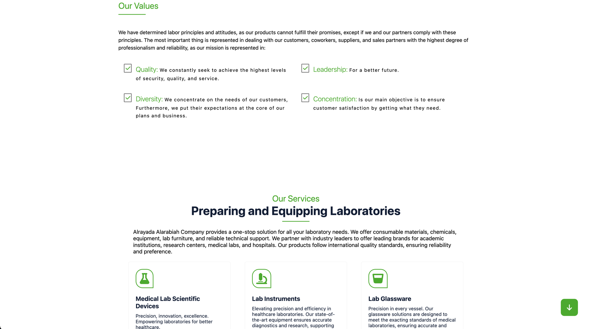
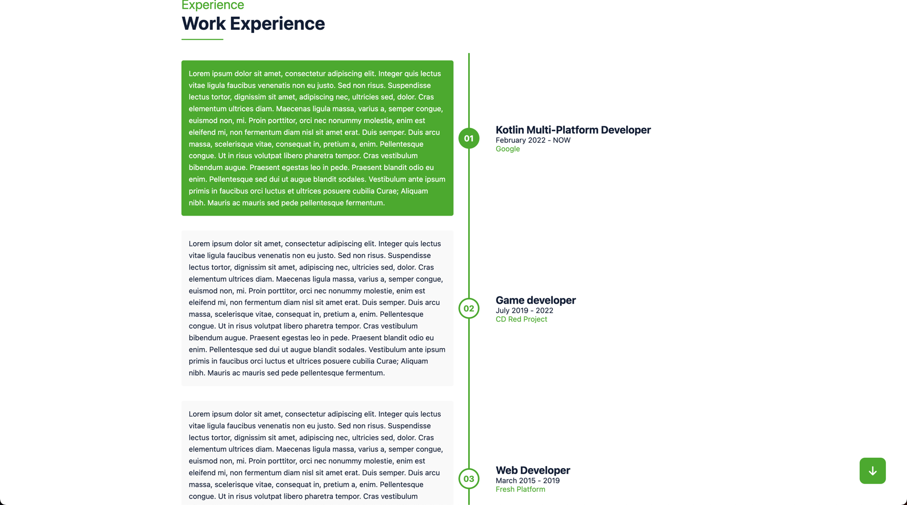

# License
This project is licensed under the Creative Commons Attribution-NonCommercial-NoDerivatives 4.0 International License. You are free to use this code for educational purposes but not for commercial use or the creation of derivative works that compete with the original website. please don't use any of the assets that related to the branding or the naming. The license can be changed

## About

A productive open source project developed for [Alrayada Alarabiah](https://alrayada.net/)
using kotlin js

The project is built using [Kobweb](https://kobweb.varabyte.com/) framework which is
built on top of Compose for Web, both are not ready and I don't recommend them for production at least for now unless you
plan to play with it or build simple websites like this one

Compose for Web is experimental
and Kobweb is built on top of it, and
it adds some extra features, like static rendering for improved SEO

Better live reload, markdown, the basics more similar to Compose Multiplatform

## How to run
1. Clone the repository and download IntelliJ IDEA or use your favorite IDE
2. Make sure you have at least JDK 11, I recommend JDK 17 at the current time 
3. Download the [Kobweb binary](https://github.com/varabyte/kobweb#install-the-kobweb-binary) and follow the steps there
4. Go to **SectionsConstants.kt** in `utils.constants` and please make sure the `FORM_URL` constant in the object `About` is empty or replace it with yours
5. Open the project in the terminal or in the integrated terminal in IDE and cd to `site` folder
6. Run `kobweb run` in the command line

## Export as static website
First navigate to the site module.
Run
`kobweb export --layout static`
in the command line and you will get the output in
`site/.kobweb/site`

To try it out, run `kobweb run --layout static --env prod`

or you can run it in development mode directly
`kobweb run`

# Known issues
* When navigate to the policy page in the menu and scroll to the very end, you will get error messages about the sections of previous page if the Animations is enabled, by `ObserveViewportEntered()` function, the error messages are in the log are NullPointerException, it doesn't cause any issues, but it shouldn't happen, when we navigate to different page, all the listeners and things registered should be disposed or paused automatically by the framework to save some memory.
* Rtl direction is not supported yet, but it's not needed for now.
* When you open the localized page url and navigate to different url, then refresh it will revert the language to the default device language, but as I said 95% of the users of this landing page are english users, I will wait while kobweb is getting improved to the next level then I plan on improve the website to the next level, the multi-language support is still experimental 

## Credits
* Thanks to [Kobweb](https://kobweb.varabyte.com/) to make the core UI elements from Compose Multiplatform like Row, Column, Box, Modifier as well as some other features
* Thanks to [Jetbrains](https://www.jetbrains.com/) for Kotlin, IntelliJ IDEA Community Edition, and Compose for Web
* Thanks to the welcoming community
* Thanks to [FontAwesome](https://fontawesome.com/) for crafting the Awesome Icons
* Thanks to [Alrayada Alarabiah](https://alrayada.net/) to actually use the website to provide the services, I often create toy projects and push them on GitHub with no use
* The base design is inspired by [Tanbir Ahmed](https://www.behance.net/gallery/90079519/Resume-Landing-page/modules/520796495), thanks to his time